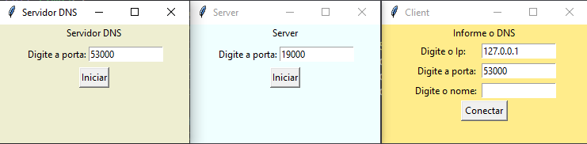
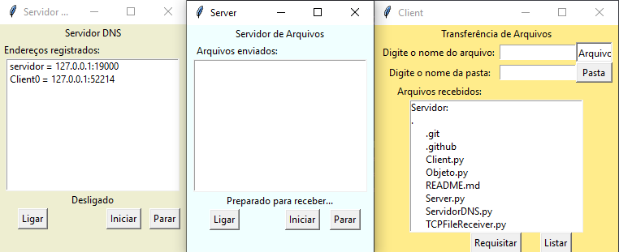

# Sockets em Python

>> Implementação de uma UDP segura

## Implementação de um servidor/cliente TCP:

É como se fosse um servidor de arquivos, onde o cliente requisita os aquivos.

- TCPServidorDNS
- TCPFileReceiver
- TCPFileSender

### Como usar

1. Inicie o TCPServidorDNS

2. Inicie o TCPFileSender, ele que vai enviar os aquivos, envie para o servidor DNS um nome de domínio.

3. Inicie o TCPFileReceiver, ele é aquele que vai enviar os comandos, requisitando os arquivos.

## Implementação de um servidor/cliente UDP seguro:

- ServidorDNS
- Client
- Server

### Como usar

1. Inicie o ServidorDNS, e confirme a porta do servidor DNS, ele vai registrar o IP:PORTA do servidor, para repassar para o client após receber um nome de domínio.

2. Inicie o Server, confirme a porta do servidor e depois coloque as informações do servidor DNS, passando para o mesmo o nome.

3. Inicie o Client, coloque as informações do DNS e peça o IP:PORTA do servidor através de um nome.

4. Você pode requisitar os arquivos do servidor, ou uma pasta inteira. Embaixo tem um botão para listar todos os arquivos no servidor.

## Extras

> Aqui você pode usar para entender como funciona de forma fácil o UDP/TCP em Python

- TCP: Um chat usando os sockets TCP

- UDP: Um chat usando sockets UDP não seguro

- UDP_Folder: Como que se envia uma pasta usando UDP